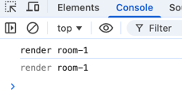

## 发现的问题
 1. components/BookingGrid/RoomRow.tsx 页面中 `BookingDrawer` 方法 声明调用顺序错误。
 2. pages/messages/index.tsx 中 getServerSideProps 造成重复的ssr渲染
 ```javascript
    export const getServerSideProps: GetServerSideProps = async (context) => {
    const ticketId = (context.query.ticketId as string) ?? null
    return {
        props: {
        initialTicketId: ticketId,
          },
        }
    }
 ```
3. Booking Calendar页面显示不足30天 切换分辨率刷新后 还是无法全部显示。
4. pages/messages/index.tsx 组件中 有多个ticketId获取来源 数据错乱
   - getServerSideProps
   - Context
   - router.query
5. components/BookingGrid/RoomRow.tsx  `hoveredCell` 放到了全局的AppContext 导致鼠标每移动一个格子 30个room全部重新渲染。 
6. Booking Calendar header时间和 body room 滑动时不一致  导致时间和 Booking Detail 不一致
7. Messages 右边的角标 在刚进入页面的时候 不显示 只有在点击进入的时候 才掉api。
8. 隐藏时间bug  components/BookingGrid/BookingGrid.tsx  `getDayLabels` 处理时间问题


## 应用的修复
1.   箭头函数先声明后调用
2.   pages/messages/index.tsx  `handleTicketClick`中使用了 router.push。 数据通过 `useSWR`获取的`tickets`。直接使用客户端CSR的切换方式就可以，也就是dom切换。如果使用了getServerSideProps 每次点击 messages list item 会请求一次服务器 `造成重复ssr` 删掉getServerSideProps
3.   hooks/useVisibleRange.ts  `useVisibleRange` hook `VISIBLE_COLUMNS`将显示页数固定死14列。导致无法显示完整。 修改为获取当前的dom ref 根据clientWidth动态计算列 
4.   多个数据源会在Messages list 数据多的时候导致不同步 id不一样。 修改为单一获取 统一使用在MessagesProvider hook中使用 router.query获取 全局共享唯一ticketId。 [ 关联问题 2 ]
5.  删掉 components/BookingGrid/RoomRow.tsx 全局变量`hoveredCell` 改为 `RoomRow`hook 组件自己维护每个小方格的index 把`onMouseLeave` 改到外层dom上 不需要在每个小方格上触发 减少事件频率。
   -  鼠标滑进小方格后 只打印当前room 不会打印 1-30 room 
6.  将Booking Calendar header改为和body一起滑动 滑动的时候实时计算日期
7. 将Messages 页面中的 `useSWR<Ticket[]>('/api/tickets', fetcher)` 提取到`MessagesContext.tsx` 页面注册provider的时候就调用
8. 此问题 没有修复 可以使用专门处理时间的库解决。`day.js`
## 权衡取舍
1. 问题4中 保留 `MessagesContext`，移除 `SSR getServerSideProps` 和页面直接读取 `router.query` 这两种状态来源，是为了在不重构消息模块的前提下把“当前工单”收敛为单一数据源，避免数据多的时候导致不同步 造成状态漂移。
2. 问题5中 将频繁触发的`onMouseEnter`事件绑定了全局context值，导致鼠标滑动整个页面全部重新re-render。hover 是一个非常高频并且比较局部的 UI 状态，不适合放进全局 Context。Context一般存放query、用户信息、主题色等等。所以删除了Context变量，该用了局部的useState
3. 问题8中  `new Date().toISOString().split('T')[0]` 会解析出一个具体的时间字符串 `2026-03-18` 但是调用`getDayLabels`之后又把这个时间字符串 `new Date()` 这样就会解析出一个UTC时间数字，当遇到不同国家地区的时候 时间会错乱。导致无法在所有国家都可以精准显示同一天`2026-03-18`，例如在美国可能是`2026-03-17`但是预约时从18号开始的。 可以使用专门处理时间的`day.js`处理 减少手动计算时间的代码。
## 如果有更多时间
1. 将Booking Calendar 增加鼠标点击滑动创建的功能
2. 页面中的三元运算符 失败的处理都是 null  可以给一些空提示和一些样式
